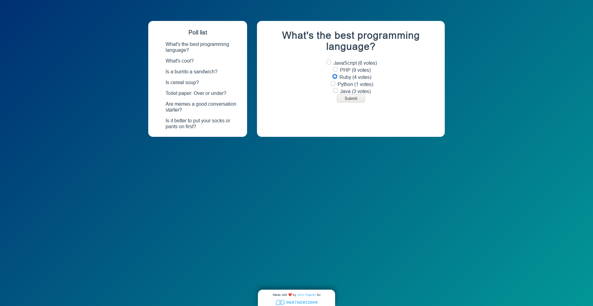

# Wordpress poll frontend

Whis is a small plugin developed as a code challenge for a job application. It's a small Vue app that interacts with the [polls plugin](https://github.com/ThatJohn/pc-wp-polls) to add poll functionality to the Wordpress API.

## How to use

-   If you haven't done so, download the [wordpress polls plugin](https://github.com/ThatJohn/pc-wp-polls) and install it into your Wordpress site.
-   Download by either cloning the repository `git clone git@github.com:ThatJohn/wp-polls-frontend.git` or by downloading and unzipping the latest release.
-   Edit the file `./store/baseurl` and change it to the base path of your Wordpress installation.
-   Run `npm install` in the project directory.
-   Still in the project directory, run `npm run serve`.
-   Navigate your browser to `http://localhost:8080`.

## TODO

-   Add action to fetch all polls. ✅
-   Add action to fetch single poll. ✅
-   Add action to cast a vote. ✅
-   Move hardcoded url to a `$baseurl` variable. ✅
-   Update the DOM upon vote. ✅
    -   Fix new bug in option selection. 🚧
-   Add poll management page. 🚧
